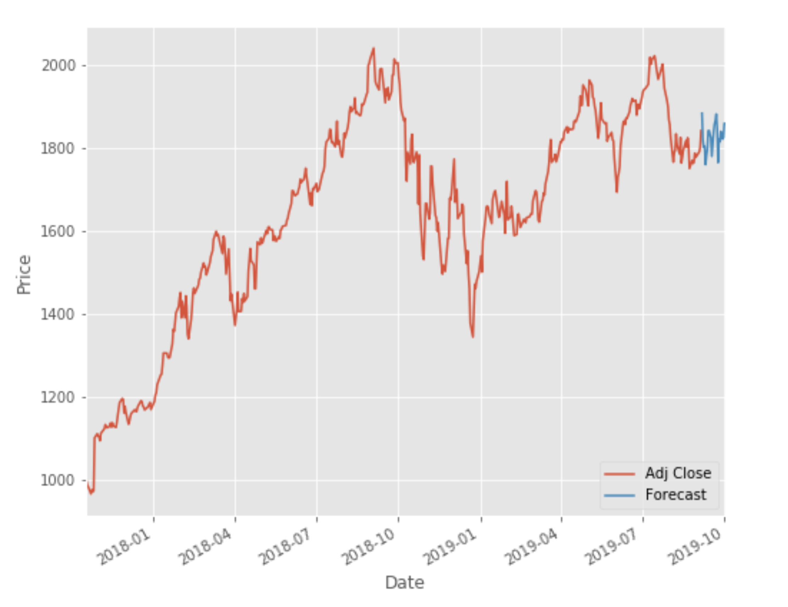

# Stock Price Prediction: [Regression scikit-learn](https://scikit-learn.org/stable/) implementations that can be used to predict stock prices.

Technologies used include scikit-learn, Python, Google Colab/Jupyter Notebook.

